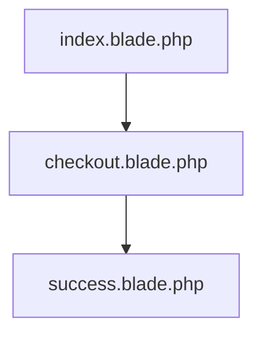

<p align="center"><a href="https://laravel.com" target="_blank"></a></p>


## Laravel Payment Integrations

This is just a project for payment integrations; Stripe, Paystack etc.

## STRIPE

Install stripe via composer again go to your command and write the below code:

```php
composer require stripe/stripe-php
```

Get your stripe key and secret you will find those things in your stripe dashboard, Just copy the publishable key and secret key and paste it into you `.env` file

```php
STRIPE_SECRET_KEY=sk_test_xxxxxxxxxxxxxxxxxxxxxxxxxxxxxxxxxxxxx
STRIPE_PUBLIC_KEY=pk_test_xxxxxxxxxxxxxxxxxxxxxxxxxxxxxxxxxxxxx
```
The implementation is in the `StripeController` file and `checkout.blade.php` file.



## License

This project is licensed under the [MIT license](https://opensource.org/licenses/MIT).
