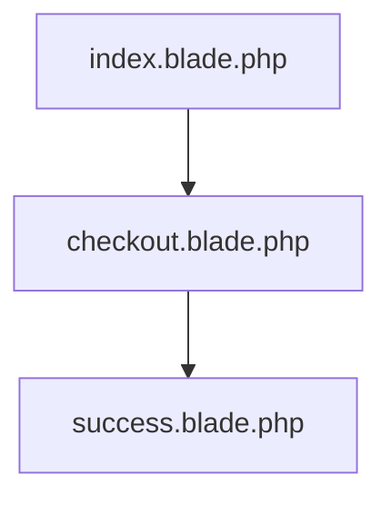
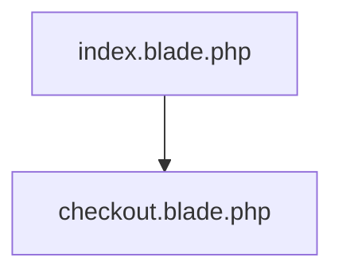

<p align="center"><a href="https://laravel.com" target="_blank"></a></p>


## Laravel Payment Integrations

This is just a project for payment integrations; Stripe, PayPal, Paystack etc.

---

## STRIPE INTEGRATION

Install stripe sdk via composer again go to your command and write the below code:

```php
composer require stripe/stripe-php
```

Get your stripe key and secret you will find those things in your stripe dashboard, Just copy the publishable key and secret key and paste it into you `.env` file

```php
STRIPE_SECRET_KEY=sk_test_xxxxxxxxxxxxxxxxxxxxxxxxxxxxxxxxxxxxx
STRIPE_PUBLIC_KEY=pk_test_xxxxxxxxxxxxxxxxxxxxxxxxxxxxxxxxxxxxx
```
The implementation is in the `StripeController` file and `checkout.blade.php` file.



---

## PAYPAL INTEGRATION

Install the Paypal package via composer again go to your command and write the below code:

```php
composer require srmklive/paypal:~3.0
```
```php
php artisan vendor:publish --provider "Srmklive\PayPal\Providers\PayPalServiceProvider"
```

Get your stripe key and secret you will find those things in your stripe dashboard, Just copy the publishable key and secret key and paste it into you `.env` file

```php
#PayPal API Mode
# Values: sandbox or live (Default: live)
PAYPAL_MODE=

#PayPal Setting & API Credentials - sandbox
PAYPAL_SANDBOX_CLIENT_ID=
PAYPAL_SANDBOX_CLIENT_SECRET=

#PayPal Setting & API Credentials - live
PAYPAL_LIVE_CLIENT_ID=
PAYPAL_LIVE_CLIENT_SECRET=
```
The implementation is in the `PaypalController` file and `index.blade.php` file.



### You can get the  [Full Documentation](https://srmklive.github.io/laravel-paypal/docs.html) here.

---

## License

This project is licensed under the [MIT license](https://opensource.org/licenses/MIT).
